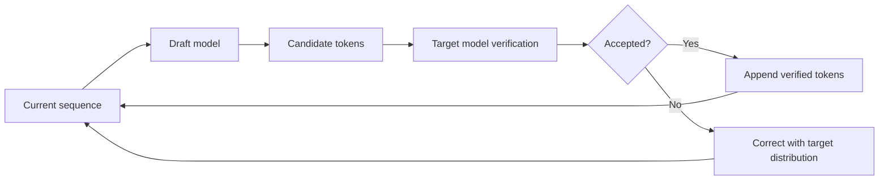

# Speculative Decoding Experiments

A research-oriented collection of implementations and experiments for accelerating autoregressive language-model inference with **speculative decoding**.

This repository explores several draft-and-verify strategies, ranging from a manual implementation of the original speculative decoding algorithm to cross-tokenizer assisted generation and fixed-tree speculative decoding. The goal is to study how model pairing, tokenizer compatibility, acceptance rate, tree structure, and verification strategy affect end-to-end generation latency.

> **Research status:** This is an active summer research project. The code is experimental and optimized for understanding, measurement, and iteration rather than production deployment.

## Highlights

- Manual speculative decoding with probabilistic token acceptance and rejection sampling.
- Hugging Face assisted generation using both matching and different tokenizer configurations.
- Manual token-level intersection for heterogeneous draft and target model vocabularies.
- A fixed-tree speculative decoding implementation with topology-aware attention masks.
- Human-readable notebook output showing accepted tokens, mismatches, latency, throughput, and acceptance statistics.
- A recorded **1.57× speedup** for fixed-tree speculative decoding over the normal target-model baseline in the included notebook run.
- Early experiments with general tree speculation and distributed draft/target execution over ZeroMQ.

## Contents

- [Background](#background)
- [Implemented Approaches](#implemented-approaches)
- [Fixed-Tree Speculative Decoding](#fixed-tree-speculative-decoding)
- [Recorded Benchmark](#recorded-benchmark)
- [Repository Structure](#repository-structure)
- [Installation](#installation)
- [Hugging Face Model Access](#hugging-face-model-access)
- [Running the Experiments](#running-the-experiments)
- [Configuration](#configuration)
- [Metrics](#metrics)
- [Benchmarking Recommendations](#benchmarking-recommendations)
- [Current Limitations](#current-limitations)
- [Research Directions](#research-directions)
- [References](#references)
- [Acknowledgments](#acknowledgments)

## Background

Autoregressive language models normally generate one token at a time. For every new token, the model performs another forward pass, creating a sequential inference bottleneck.

Speculative decoding reduces the number of expensive target-model calls:

1. A smaller and faster **draft model** proposes several candidate tokens.
2. The larger **target model** evaluates those candidates in parallel.
3. Valid candidates are accepted.
4. At the first rejection, the target distribution is used to correct or replace the rejected proposal.
5. Generation continues from the verified sequence.

When the draft model predicts tokens that the target model is likely to produce, multiple output tokens can be committed after one target-model verification pass.



A useful speedup generally requires the saved target-model work to be greater than the additional cost of drafting, token translation, tree construction, and verification.

## Implemented Approaches

| File | Method | Draft model | Target model | Tokenizer relationship | Status |
|---|---|---|---|---|---|
| `speculative_decoding.py` | Manual probabilistic speculative decoding | `meta-llama/Llama-3.2-1B` | `meta-llama/Llama-3.2-3B` | Same model family | Working experiment |
| `hface_tli.py` | Hugging Face cross-tokenizer assisted generation | `openai-community/gpt2-large` | `meta-llama/Llama-3.2-3B` | Different tokenizers | Working experiment |
| `hface_uag.py` | Manual text-bridge assisted generation | `openai-community/gpt2-large` | `meta-llama/Llama-3.2-3B` | Different tokenizers | Exploratory |
| `manual_tli.py` | Manual token-level vocabulary intersection | `double7/vicuna-68m` | `google/gemma-2-2b-it` | Different tokenizers | Working research prototype |
| `fixedTreeSD.py` | Fixed-tree speculative decoding with greedy verification | `distilbert/distilgpt2` | `openai-community/gpt2-large` | Shared GPT-2 vocabulary family | Working experiment |
| `fixedTreeSD.ipynb` | Notebook version of fixed-tree decoding and benchmark | `distilbert/distilgpt2` | `openai-community/gpt2-large` | Shared GPT-2 vocabulary family | Recommended demonstration |
| `speculative_tree.py` | General breadth-first speculation-tree prototype | `gpt2` | `gpt2-large` | Shared GPT-2 tokenizer family | Exploratory prototype |
| `draft.py` / `server.py` | Distributed draft and target execution over ZeroMQ | Llama 3.2 1B client | Qwen 2.5 3B server | Different tokenizers | Infrastructure prototype |

### 1. Manual speculative decoding

`speculative_decoding.py` implements the core algorithm directly.

For each decoding iteration:

- The draft model proposes up to `gamma` tokens.
- The target model scores the complete candidate continuation in one forward pass.
- Each draft token is accepted with probability

\[
\alpha = \min\left(1, \frac{p(x)}{q(x)}\right),
\]

where `p` is the target-model probability and `q` is the draft-model probability.

- If a token is rejected, a replacement is sampled from the normalized positive portion of

\[
\max(p-q, 0).
\]

- If all proposed tokens are accepted, the target model supplies an additional bonus token.

The script also compares speculative latency with normal target-model generation and reports the speedup factor.

### 2. Hugging Face cross-tokenizer assisted generation

`hface_tli.py` uses the Hugging Face `generate()` interface with:

- `assistant_model`
- `tokenizer`
- `assistant_tokenizer`

This allows the assistant and target models to use different tokenizers. In current Hugging Face terminology, this is generally described as **Universal Assisted Decoding/Generation**. The repository labels this experiment as TLI because it studies speculative generation across tokenizer boundaries.

This implementation is useful as a library-backed reference against which the manual cross-tokenizer methods can be compared.

### 3. Manual text-bridge assisted generation

`hface_uag.py` manually connects models with different tokenizers by:

1. Generating candidate tokens with the assistant tokenizer.
2. Decoding those tokens into text.
3. Appending the candidate text to the current sequence.
4. Re-tokenizing the combined text using the target tokenizer.
5. Verifying the resulting target-token candidates greedily.

This is a simplified research implementation. Full cross-tokenizer alignment is more complicated because token boundaries can change when text is decoded and re-encoded.

### 4. Manual token-level intersection

`manual_tli.py` creates an explicit vocabulary intersection between heterogeneous tokenizers.

The experiment:

- Builds a mapping from draft token IDs to target token IDs when both vocabularies contain the exact same token string.
- Uses a custom `LogitsProcessor` to restrict draft generation to tokens inside the intersection.
- Maps accepted draft tokens into the target vocabulary.
- Maps the draft probability distribution into target-vocabulary space during rejection correction.
- Tracks accepted tokens, drafted tokens, acceptance rate, latency, and speedup.

This method is intentionally different from Hugging Face Universal Assisted Decoding. Hugging Face uses text re-encoding and sequence alignment, while this implementation studies exact token-string overlap and direct vocabulary mapping.

## Fixed-Tree Speculative Decoding

The main recent implementation is available in:

- `fixedTreeSD.py`
- `fixedTreeSD.ipynb`

Instead of proposing only one linear sequence, the draft model constructs a small fixed tree of likely continuations. The target model evaluates the packed tree in one forward pass, and the verifier follows the branch that agrees with the target model.

### Tree configuration

The default configuration is:

```python
k_config = [1, 2, 2]
```

Each value specifies the number of top candidate tokens expanded from every active node at that depth:

- Depth 1: expand the top 1 token.
- Depth 2: expand the top 2 tokens from each active node.
- Depth 3: expand the top 2 tokens from each active node.

This creates several possible continuations without requiring the target model to verify every path through separate calls.

```text
Current sequence
└── top-1 token
    ├── top-1 token
    │   ├── top-1 token
    │   └── top-2 token
    └── top-2 token
        ├── top-1 token
        └── top-2 token
```

### Tree construction

`build_draft_tree()` stores the packed tree using:

- `token_tree`: flattened token IDs for the prompt and speculative nodes.
- `parent_array`: the parent index of each node.
- `probs_array`: draft probabilities associated with each node.
- `active_nodes`: the frontier expanded at the next tree depth.

### Topology-aware attention mask

A normal causal mask is not sufficient for a flattened tree. A speculative node must be allowed to attend to:

- The complete original prompt.
- Itself.
- Its own ancestors.

It must not attend to tokens belonging to sibling branches or unrelated paths.

`build_full_tree_attention_mask()` creates this tree-aware mask from the `parent_array`.

### Tree position IDs

Nodes at the same logical depth should share the same sequence position even if they occupy different indices in the flattened representation.

`build_tree_position_ids()` assigns each child a position equal to:

```text
parent position + 1
```

This preserves the autoregressive position structure of each root-to-leaf path.

### Greedy verification

The packed tree is sent through the target model once. Starting at the final prompt token, the verifier:

1. Reads the target model's greedy next token.
2. Checks whether that token exists among the current node's children.
3. Follows the matching child when one exists.
4. Continues down the tree until a mismatch occurs or the maximum path depth is reached.
5. On mismatch, appends the target model's preferred token as a fallback/bonus token.

This method produces the same continuation as the greedy target-model baseline for the verified steps, provided the model inputs, masking, position IDs, and stopping behavior remain equivalent.

## Recorded Benchmark

The committed output in `fixedTreeSD.ipynb` contains the following single-run result for 200 generated tokens:

| Metric | Fixed-tree speculative decoding | Normal target baseline |
|---|---:|---:|
| Latency | 2.1352 s | 3.3450 s |
| Throughput | 93.67 tokens/s | 59.79 tokens/s |
| Speedup | **1.57×** | 1.00× |

Additional fixed-tree metrics from the same run:

| Metric | Result |
|---|---:|
| Generated tokens | 200 |
| Speculative iterations | 66 |
| Accepted draft tokens | 135 |
| Target fallback/bonus tokens | 65 |
| Rejected structural tree nodes | 327 |
| Path acceptance rate | 68.18% |
| Tree acceptance rate | 29.22% |
| Average accepted draft tokens per step | 2.05 |

> These values represent one recorded experiment. They are not universal performance guarantees. Results depend on the GPU, PyTorch and Transformers versions, model-loading dtype, prompt, output length, decoding settings, tree shape, and system load. The notebook does not currently record the hardware configuration used for this run.

## Repository Structure

```text
Speculative-Decoding/
├── fixedTreeSD.ipynb       # Recommended fixed-tree walkthrough and saved benchmark output
├── fixedTreeSD.py          # Script implementation of fixed-tree speculative decoding
├── speculative_decoding.py # Manual standard speculative decoding
├── hface_tli.py            # Hugging Face cross-tokenizer assisted generation
├── hface_uag.py            # Manual text-bridge cross-tokenizer experiment
├── manual_tli.py           # Exact vocabulary-intersection implementation
├── speculative_tree.py     # General tree-speculation prototype
├── draft.py                # ZeroMQ draft-model client prototype
├── server.py               # ZeroMQ target-model verifier prototype
└── .gitignore
```

## Installation

### 1. Clone the repository

```bash
git clone https://github.com/abhizz11/Speculative-Decoding.git
cd Speculative-Decoding
```

### 2. Create a virtual environment

A recent Python 3 environment is required. Python 3.10 or 3.11 is a conservative choice for broad PyTorch and Transformers compatibility.

```bash
python -m venv .venv
```

Activate it:

```bash
# Linux or macOS
source .venv/bin/activate

# Windows PowerShell
.venv\Scripts\Activate.ps1
```

### 3. Install dependencies

Install PyTorch using the command appropriate for your CUDA version, then install the remaining packages:

```bash
python -m pip install --upgrade pip
pip install torch transformers accelerate sentencepiece protobuf safetensors
pip install jupyterlab ipykernel pyzmq
```

For NVIDIA GPU execution, verify that PyTorch can access CUDA:

```bash
python -c "import torch; print(torch.cuda.is_available()); print(torch.cuda.get_device_name(0) if torch.cuda.is_available() else 'CPU only')"
```

### Hardware notes

- A CUDA-capable NVIDIA GPU is strongly recommended.
- Several scripts load both the draft and target model on the same device.
- Required VRAM depends on the selected model pair and dtype.
- Some experiment files hardcode CUDA arguments or use `float16`, so CPU execution is not fully supported across the repository.
- Model loading is performed before latency measurement in the primary experiments.

## Hugging Face Model Access

Some experiments use gated models, including Llama and Gemma checkpoints.

Before running those scripts:

1. Create a Hugging Face account.
2. Accept the license or access conditions on the required model pages.
3. Authenticate locally:

```bash
hf auth login
```

The GPT-2 and DistilGPT2 fixed-tree experiment is the easiest starting point because it does not rely on the gated Llama/Gemma model pairs used by other scripts.

## Running the Experiments

### Recommended: fixed-tree notebook

```bash
jupyter lab fixedTreeSD.ipynb
```

Run the notebook cells to inspect:

- Every speculative iteration.
- Accepted tree nodes.
- Mismatch points.
- Generated token IDs and decoded text.
- Draft acceptance statistics.
- Baseline and speculative latency.
- Tokens per second.
- Final speedup factor.

For less verbose output, set:

```python
debug = False
```

when calling `fixed_tree_speculative_generate_greedy()`.

### Fixed-tree Python script

```bash
python fixedTreeSD.py
```

The script currently uses:

```python
prompt = "Once upon a time there was a little girl named Alice "
k_config = [1, 2, 2]
max_new_tokens = 500
```

Edit these values near the bottom of the script before running a new experiment.

### Manual standard speculative decoding

```bash
python speculative_decoding.py
```

Important configuration values include:

```python
gamma = 1
max_new_tokens = 50
```

Increase `gamma` to test longer draft sequences, while monitoring whether the increased draft cost and rejection rate reduce the overall speedup.

### Hugging Face cross-tokenizer assisted generation

```bash
python hface_tli.py
```

This experiment passes both tokenizers and the assistant model to the target model's `generate()` call.

### Manual text-bridge cross-tokenizer experiment

```bash
python hface_uag.py
```

This file is useful for studying the complications introduced by decoding assistant tokens to text and re-tokenizing them for the target model.

### Manual token-level intersection

```bash
python manual_tli.py
```

At startup, the script reports:

- Draft vocabulary size.
- Target vocabulary size.
- Intersection size.
- Draft-vocabulary coverage.
- Example token mappings.

The final report includes latency, speedup, accepted draft tokens, total drafted tokens, and acceptance rate.

### General tree-speculation prototype

```bash
python speculative_tree.py
```

This is an exploratory implementation of breadth-first tree construction and path-based verification. It should be treated as a research prototype rather than the primary benchmark path.

### Distributed ZeroMQ prototype

The distributed experiment separates drafting and target verification into two processes.

Start the target server:

```bash
python server.py
```

Then start the draft client in another terminal or on the connected device:

```bash
python draft.py
```

The default endpoint is:

```text
tcp://127.0.0.1:5555
```

For execution across two machines, update the bind/connect addresses and configure the network or SSH tunnel appropriately.

> The current distributed prototype uses model families with different tokenizers but directly transfers token IDs and probability vectors. It is an infrastructure experiment and should not be used for correctness claims until explicit tokenizer translation or vocabulary alignment is added.

## Configuration

The most important experimental controls are described below.

### `prompt`

The initial text context. Acceptance rate can vary substantially across prompts and domains.

### `max_new_tokens`

The maximum number of tokens generated after the prompt. Longer generations reduce the relative impact of one-time setup and warm-up overhead.

### `gamma`

The number of linear tokens proposed by the draft model in one iteration.

A larger value may:

- Increase the number of tokens accepted per target call.
- Increase draft-model computation.
- Increase the chance of a rejection before the end of the draft.

### `k_config`

The branching factor at each fixed-tree depth.

For example:

```python
k_config = [1, 2, 2]
```

A wider or deeper tree improves candidate coverage but also increases:

- Draft-model calls.
- Packed verification length.
- Attention-mask size.
- Number of rejected structural nodes.

### Model pair

Draft-model quality and speed are both important. A draft model that is extremely fast but poorly aligned with the target may have a low acceptance rate. A strong draft model may accept more tokens but cost too much to run.

### Decoding strategy

Greedy and sampling-based experiments should not be compared without controlling decoding settings. Ensure that baseline and speculative runs use compatible values for:

- `do_sample`
- `temperature`
- `top_p`
- random seed
- EOS and padding behavior

## Metrics

### Latency

Wall-clock generation time, excluding model download and model initialization in the current scripts.

CUDA is synchronized before and after timed sections to prevent asynchronous GPU execution from producing misleading measurements.

### Throughput

\[
\text{throughput} = \frac{\text{generated tokens}}{\text{latency}}
\]

Reported in tokens per second.

### Speedup

\[
\text{speedup} = \frac{\text{baseline latency}}{\text{speculative latency}}
\]

- Greater than `1.0×`: speculative decoding is faster.
- Equal to `1.0×`: no measured improvement.
- Less than `1.0×`: speculative overhead is greater than the saved target-model work.

### Draft acceptance rate

For the linear implementations:

\[
\text{acceptance rate} = \frac{\text{accepted draft tokens}}{\text{total proposed draft tokens}}
\]

### Fixed-tree path acceptance rate

Compares accepted draft nodes with the maximum number of draft positions available along the selected paths:

\[
\text{path acceptance rate} =
\frac{\text{accepted draft nodes}}
{\text{iterations} \times \text{tree depth}}
\]

### Fixed-tree structural acceptance rate

Compares accepted draft nodes with all tree nodes evaluated:

\[
\text{tree acceptance rate} =
\frac{\text{accepted draft nodes}}
{\text{total speculative tree nodes evaluated}}
\]

The structural rate is normally lower because only one root-to-leaf path can contribute accepted tokens while sibling nodes are still evaluated.

## Benchmarking Recommendations

For more reliable comparisons:

1. Record the exact GPU model, VRAM, driver, CUDA, PyTorch, and Transformers versions.
2. Run several untimed warm-up generations before collecting measurements.
3. Use the same prompt set, token limit, EOS behavior, and decoding strategy for every method.
4. Exclude model-loading time unless startup latency is part of the research question.
5. Run each configuration multiple times and report the median, mean, and standard deviation.
6. Use multiple prompt categories, such as storytelling, summarization, code, dialogue, and factual continuation.
7. Measure peak GPU memory in addition to latency.
8. Record acceptance rate alongside speedup; either metric alone can be misleading.
9. Separate time spent in drafting, target verification, tokenizer translation, and Python control flow.
10. Save raw experiment results to JSON or CSV for later visualization.

A suggested benchmark record is:

```json
{
  "method": "fixed_tree",
  "draft_model": "distilbert/distilgpt2",
  "target_model": "openai-community/gpt2-large",
  "prompt_id": "story_001",
  "max_new_tokens": 200,
  "k_config": [1, 2, 2],
  "baseline_latency_seconds": 3.3450,
  "speculative_latency_seconds": 2.1352,
  "speedup": 1.57,
  "baseline_tokens_per_second": 59.79,
  "speculative_tokens_per_second": 93.67,
  "accepted_draft_tokens": 135,
  "iterations": 66
}
```

## Current Limitations

- The repository is a collection of experiment scripts rather than a unified Python package or command-line interface.
- Model IDs, prompts, generation lengths, and decoding parameters are currently hardcoded.
- The saved benchmark does not include a hardware and software environment record.
- Performance results are based on small model pairs and should not be generalized to larger production models without additional testing.
- Some scripts assume CUDA even though a CPU fallback variable is defined.
- The fixed-tree implementation currently focuses on greedy verification rather than distribution-preserving sampling.
- Greedy generation with small GPT-2-family models can become repetitive; this is a model/decoding behavior and not by itself evidence of an incorrect speed measurement.
- Exact token-string intersection can cover only a subset of two heterogeneous vocabularies and is not equivalent to full tokenizer translation.
- Text-based tokenizer translation can change token boundaries and requires careful context alignment.
- Python loops, repeated tokenization, and repeated draft-model calls may hide the theoretical benefit of an algorithm.
- The distributed ZeroMQ path requires a correctness-preserving tokenizer-alignment mechanism before it can be evaluated as true cross-model speculative decoding.
- No automated correctness tests or benchmark suite are included yet.

## Research Directions

Potential next steps include:

- Add a shared configuration system for models, prompts, seeds, and generation parameters.
- Create a single benchmark runner covering every decoding method.
- Record results in CSV or JSON and generate latency, throughput, and acceptance plots.
- Add GPU memory and energy measurements.
- Compare fixed, dynamic, and confidence-based speculation lengths.
- Search for optimal `gamma` and `k_config` values automatically.
- Evaluate on standard datasets instead of a single hand-written prompt.
- Add exact output-distribution tests for probabilistic implementations.
- Add greedy equivalence tests for fixed-tree verification.
- Cache draft-model states during tree expansion.
- Reduce Python overhead through vectorization, compilation, or custom kernels.
- Investigate tree pruning based on cumulative draft probability.
- Add a correct cross-tokenizer translation layer to the distributed implementation.
- Test heterogeneous hardware, including edge-device drafting and server-side verification.
- Compare against current Hugging Face assisted-decoding baselines using identical model pairs.

## References

1. Yaniv Leviathan, Matan Kalman, and Yossi Matias. **Fast Inference from Transformers via Speculative Decoding.** ICML 2023.  
   https://arxiv.org/abs/2211.17192

2. Charlie Chen, Sebastian Borgeaud, Geoffrey Irving, Jean-Baptiste Lespiau, Laurent Sifre, and John Jumper. **Accelerating Large Language Model Decoding with Speculative Sampling.** 2023.  
   https://arxiv.org/abs/2302.01318

3. Hugging Face Transformers documentation. **Assisted Decoding.**  
   https://huggingface.co/docs/transformers/assisted_decoding

4. Daniel Korat et al. **Universal Assisted Generation: Faster Decoding with Any Assistant Model.** Hugging Face and Intel Labs, 2024.  
   https://huggingface.co/blog/universal_assisted_generation

## Citing This Repository

```bibtex
@misc{speculative_decoding_experiments_2026,
  author       = {abhizz11},
  title        = {Speculative Decoding Experiments},
  year         = {2026},
  howpublished = {GitHub repository},
  url          = {https://github.com/abhizz11/Speculative-Decoding}
}
```

## Acknowledgments

This repository is being developed as a university summer research project under the supervision of **Dr. Yu Zhang** at **Fisk University**.

The project builds on the speculative decoding research literature and the assisted-generation functionality available in Hugging Face Transformers.

## License

This repository does not currently include a `LICENSE` file. Add an appropriate open-source license before distributing the project for reuse or accepting external contributions.
